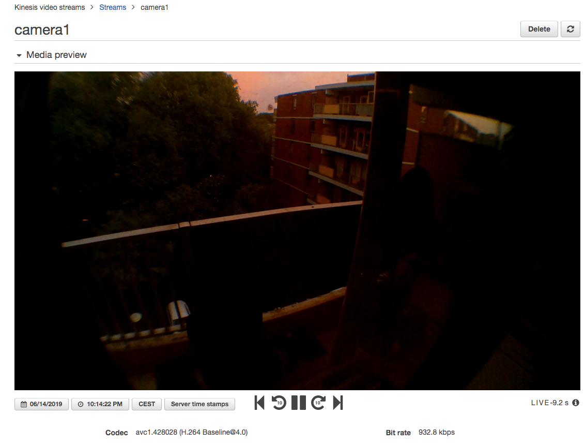

# Streaming video from Raspberry Pi 3(+) to AWS Kinesis Video

## Camera

Install the camera module to the Raspberry Pi. Enable it in raspi-config.


## amazon-kinesis-video-streams-producer-sdk-cpp

You need the _kvssink_ plugin for _gstreamer_ to be able to send your video stream to aws kinesis.

For this you have to build the [Amazon Kinesis Video Streams Producer SDK C/C++](https://github.com/awslabs/amazon-kinesis-video-streams-producer-sdk-cpp) project.

### install prerequisites

See also [Install Steps for Ubuntu 17.x and Raspbian Stretch using apt-get](https://github.com/awslabs/amazon-kinesis-video-streams-producer-sdk-cpp/blob/master/install-instructions-linux.md#install-steps-for-ubuntu-17x-and-raspbian-stretch-using-apt-get)

Install with apt-get / aptitude:


```
git
cmake
g++
libssl-dev
libcurl4-openssl-dev
liblog4cplus-1.1-9
liblog4cplus-dev
libgstreamer1.0-dev
libgstreamer-plugins-base1.0-dev
gstreamer1.0-plugins-base-apps
gstreamer1.0-plugins-bad
gstreamer1.0-plugins-good
gstreamer1.0-plugins-ugly
gstreamer1.0-tools
gstreamer1.0-omx
```


Check if your gstreamer can find the omx plugins.

```
pi@camera2:~ $ gst-inspect-1.0 | grep omx
omx:  omxmpeg2videodec: OpenMAX MPEG2 Video Decoder
omx:  omxmpeg4videodec: OpenMAX MPEG4 Video Decoder
...
```
If you don't see them. It might help to delete the directory `~/.cache/gstreamer-1.0` directory.

### build

Clone the repository of the [Amazon Kinesis Video Streams Producer SDK C/C++](https://github.com/awslabs/amazon-kinesis-video-streams-producer-sdk-cpp) project.

Go into the project directory, then the subdirectory _kinesis_video_native_build_ and run:

```
./min-install-script
```


### Install

When the _min-install-script_ has run successfully. It has built a number of sample applications and a couple of libraries.

It is the latter we are interested in. More specifically:

* libgstkvssink.so The kvssink gstreamer plugin
* libproducer.so The producer library the `libgstkvssink.so` has been linked to

Create a directory to house the gstreamer plugin:

```
mkdir /usr/local/lib/gstreamer-1.0
```

Put the `libgstkvssink.so` in this directory. We will tell gstreamer of it's existence by adding the directory to the GST_PLUGIN_PATH environment variable.

`libgstkvssink.so` is linked to `libproducer.so`. So put the latter into `/usr/local/lib`. Run ldconfig -v as root. You will see that the library will be added to the ld search path.


### Check

pi@camera2:~ $ gst-inspect-1.0 | grep kvssink
kvssink:  kvssink: KVS Sink


## The streaming service

### Install

Install the file from this repository by copying them to:


* etc/systemd/system/kinesis-video.service -> /etc/systemd/system/kinesis-video.service
* etc/default/kinesis-video -> /etc/default/kinesis-video
* sbin/aws_kinesis_live_stream.sh

Run `systemctl daemon-reload`, to scan the new service.

### Configure

#### AWS

Setup a _iam_ user with the correct permissions. Setup a Kinesis Video Stream.
See [Getting Started](https://docs.aws.amazon.com/kinesisvideostreams/latest/dg/getting-started.html)


#### The raspberry pi

Edit `/etc/default/kinesis-video`

Set the correct access-key, secret-access-key , aws-region and stream name to use.
Check that the GST_PLUGIN_PATH includes the directory where you have put the kvssink plugin.

Check / edit `/etc/systemd/system/kinesis-video.service`. Note the 'user'.

Create this user and add it to the `video` group.

Check / edit `sbin/aws_kinesis_live_stream.sh`. Note the LOG_CONFIG.

Copy the `kvs_log_configuration` from the _Amazon Kinesis Video Streams Producer SDK C/C++_ project's `kinesis-video-native-build` directory and put it in the directory where LOG_CONFIG points to.

If necessary create this directory and chown it to the user you created above.

I would recommend editing the `kvs_log_configuration` and modifying the root logging level. The DEBUG level produces an awful lot of logging.


### Enable and start

* systemctl enable kinesis-video
* systemctl start kinesis-video
* systemctl status kinesis-video

### View the stream at aws kinesis dashboard



... yes it was getting dark after all this 'hacking' and writing ...
